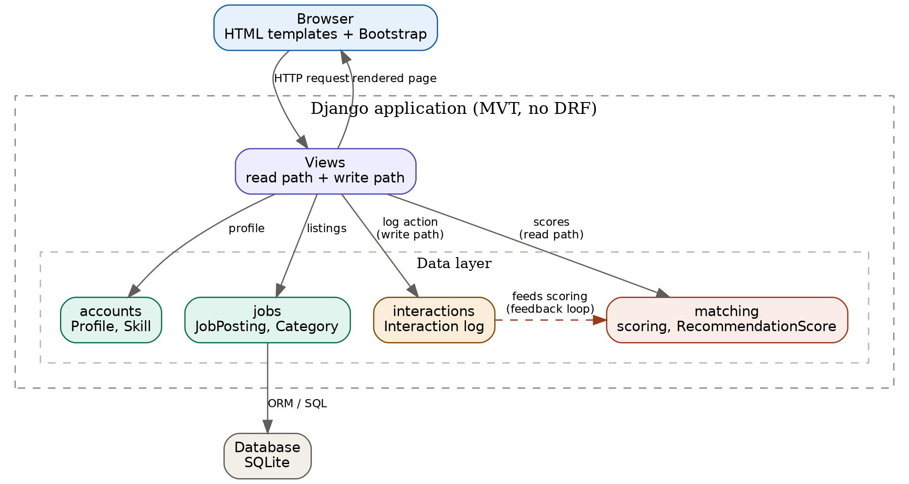
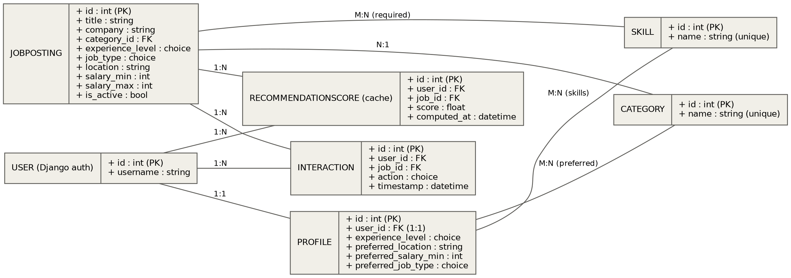
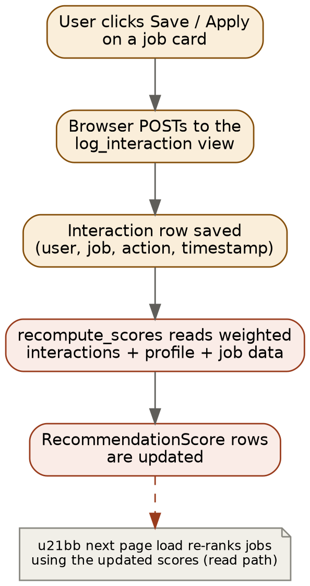
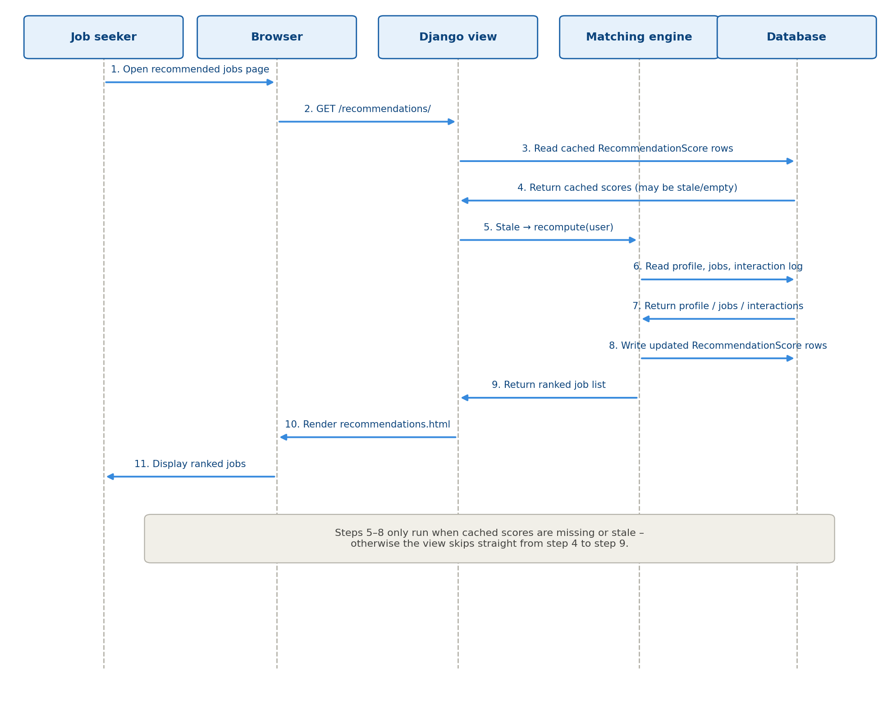

# Software Design Document

### Job Recommendation Engine

*BSE2301 · Software Engineering Mini Project 2 · Group B · Version 1.1 · 20th July, 2026*

## 1. Introduction

This Software Design Document (SDD) describes how the Job Recommendation Engine is built to satisfy the requirements in the accompanying SRS. It covers the system architecture, data models, matching logic, and the flow of a request through the system.

The application recommends job openings to users based on their profile (skills, experience level) and their behaviour (clicks, saves, applications). It is built in Django using server-rendered templates – no separate API layer or JavaScript framework is required. Recommendations are produced by a rule-based, weighted scoring engine that is refined over time by tracked user interactions.

### Core capabilities

- Match candidates to jobs using a scoring algorithm (data matching).

- Store explicit and implicit user preferences.

- Let users search and filter job listings.

- Track clicks / applications to improve future recommendations.

- Persist all of the above in a structured relational schema.

## 2. System Architecture

The application follows Django's Model-View-Template (MVT) pattern in a simple three-layer shape: the browser renders server-side templates, Django views hold the request-handling and matching logic, and the ORM talks to a single relational database. Keeping everything inside one Django project, rather than splitting into separate services, matches the one-week build window – there is no separate API layer or frontend framework to coordinate.

The system has two structural layers and one feedback cycle connecting them.

### Data layer – four Django apps, each owning one part of the schema

| **App**      | **Owns**                                     |
|--------------|----------------------------------------------|
| accounts     | User profiles, skills, explicit preferences. |
| jobs         | Job postings, categories.                    |
| interactions | Click / save / apply logs.                   |
| matching     | Cached recommendation scores, scoring logic. |

### Request layer (Django MVT, no DRF)

- Read path – browser requests a page → view queries the ORM (profile, jobs, cached scores) → template renders HTML → browser displays it.

- Write path – user clicks apply/save on a job card → a plain HTML form POSTs to a view → an Interaction row is saved → user is redirected back.

### Feedback loop

Interaction rows accumulate → the matching engine reads them, weighted by action type → scores are recomputed → the next time the user visits, recommendations reflect the update. This loop is what makes the system “learn” without needing machine-learning infrastructure – it is a weighted read of logged behaviour. No JavaScript or REST API is required anywhere in this design; everything is standard Django views, forms, and templates.

*Figure 1 – System architecture: data layer, request layer, and feedback loop*

## 3. Data Models

The schema follows the four Django apps above, one model group per app. The full picture:

*Figure 2 – Entity-relationship diagram*

### 3.1 accounts app

**Skill**

| **Field** | **Type**                                 |
|-----------|------------------------------------------|
| name      | CharField, unique – e.g. “Python”, “SQL” |

*Kept as its own table rather than a text field because matching depends on exact set comparisons (user skills ∩ job skills) and because skills are a genuine many-to-many relationship – one skill belongs to many users and many jobs. A free-text field would let the same skill be entered inconsistently (“python” vs “Python3”) and silently break matching.*

**Profile**

| **Field**            | **Type**                   | **Notes**                                 |
|----------------------|----------------------------|-------------------------------------------|
| user                 | OneToOneField → User       | Django's built-in auth user               |
| skills               | ManyToManyField → Skill    |                                           |
| experience_level     | CharField, choices         | entry / mid / senior                      |
| preferred_location   | CharField                  | explicit preference                       |
| preferred_salary_min | IntegerField, nullable     | explicit preference                       |
| preferred_categories | ManyToManyField → Category | explicit preference                       |
| preferred_job_type   | CharField, choices         | full-time / part-time / contract / remote |

### 3.2 jobs app

**Category**

| **Field** | **Type**          |
|-----------|-------------------|
| name      | CharField, unique |

**JobPosting**

| **Field**               | **Type**                | **Notes**                                 |
|-------------------------|-------------------------|-------------------------------------------|
| title                   | CharField               |                                           |
| company                 | CharField               |                                           |
| description             | TextField               |                                           |
| category                | ForeignKey → Category   |                                           |
| required_skills         | ManyToManyField → Skill |                                           |
| experience_level        | CharField, choices      | entry / mid / senior                      |
| job_type                | CharField, choices      | full-time / part-time / contract / remote |
| location                | CharField               |                                           |
| salary_min / salary_max | IntegerField, nullable  |                                           |
| posted_at               | DateTimeField, auto     |                                           |
| is_active               | BooleanField            |                                           |

*Indexed on location, category, and is_active, since these are the fields most queried by search and filtering.*

### 3.3 interactions app

**Interaction**

| **Field** | **Type**                | **Notes**                             |
|-----------|-------------------------|---------------------------------------|
| user      | ForeignKey → User       |                                       |
| job       | ForeignKey → JobPosting |                                       |
| action    | CharField, choices      | view / click / save / apply / dismiss |
| timestamp | DateTimeField, auto     |                                       |

*This single table doubles as both the interaction log and the implicit-preference store – there is no separate “preferences” table for behaviour. Preferences are derived at scoring time by weighting rows here, rather than being persisted as separate fields, so they update automatically as behaviour changes without extra writes.*

### 3.4 matching app

**RecommendationScore (cache, not source of truth)**

| **Field**   | **Type**                | **Notes** |
|-------------|-------------------------|-----------|
| user        | ForeignKey → User       |           |
| job         | ForeignKey → JobPosting |           |
| score       | FloatField              |           |
| computed_at | DateTimeField, auto     |           |

*Unique together on (user, job). Recomputed periodically or on demand – never edited by hand – so the scoring algorithm can change later without touching the schema.*

## 4. Preferences

Two kinds, stored differently on purpose.

### Explicit

The user states them directly. Stored as plain fields/relations on Profile: preferred_location, preferred_salary_min, preferred_categories, preferred_job_type. Set through a normal Django form on the user's profile page.

### Implicit

Inferred from behaviour, never stored as columns. Derived on the fly from Interaction rows, weighted by action type (see Section 5). This means implicit-preference “updates” happen automatically as new interactions are logged – there is nothing to keep in sync.

## 5. Matching Criteria and Scoring

Rule-based / weighted scoring – no machine learning is required for the core deliverable. Computed in matching/services.py, kept out of views and models so it is testable in isolation.

| **Criterion**             | **Signal**                                           | **Weight (example)**                             |
|---------------------------|------------------------------------------------------|--------------------------------------------------|
| Skill overlap             | len(user_skills ∩ job_skills)                        | +10 per matching skill                           |
| Experience level match    | job.experience_level == profile.experience_level     | +15                                              |
| Category match            | job.category in profile.preferred_categories         | +10                                              |
| Location match            | profile.preferred_location == job.location           | +5                                               |
| Job type match            | job.job_type == profile.preferred_job_type           | +5                                               |
| Past positive interaction | weighted sum of Interaction actions for similar jobs | apply +5, save +3, click +2, view +1, dismiss −3 |

Total score per (user, job) pair is the sum across all applicable criteria. Highest-scoring jobs are shown first.

Recomputation happens either on demand – when the user loads the recommendations page, fine for small datasets – or via a scheduled management command (recompute_scores), which is more realistic to demo as “the system learning over time.”

Stretch goal – collaborative filtering: recommend jobs that similar users (by interaction pattern) engaged with, using pandas / scikit-learn in a standalone command, writing results back into RecommendationScore. This is an optional extension, not required for the core deliverable.

## 6. Search and Filtering

Implemented with django-filter against JobPosting, wired into a plain Django ListView (no DRF). Filterable fields: category, experience_level, job_type, location (contains match), salary_min (≥ match). Rendered as a normal HTML form via {{ filter.form }} in the template – no JavaScript needed.

## 7. Interaction Tracking

Any user action that should influence future recommendations (view, click, save, apply, dismiss) is logged by POSTing a small HTML form to a log_interaction view, which creates an Interaction row and redirects back to the referring page. This is the sole write path feeding the feedback loop described in Section 2.

*Figure 3 – Write path and feedback loop*

## 8. Process Design – Recommendation Read Path

The diagram below traces REQ-05 and REQ-06 in detail: a user opens the recommended-jobs page and the system returns a ranked list, using the caching and on-demand recomputation described in Sections 3.4 and 5.

*Figure 4 – Sequence diagram for viewing recommended jobs*

## 9. Module Design

The project is split into four small Django apps so team members can work in parallel without constantly touching the same files.

| **Django app** | **Responsibility**                                                                         | **Key models / files**                                                    |
|----------------|--------------------------------------------------------------------------------------------|---------------------------------------------------------------------------|
| accounts       | User signup/login and profile editing; stores explicit preferences.                        | Profile, Skill, forms.py, views.py                                        |
| jobs           | Job postings and categories; search, filtering, admin CRUD.                                | JobPosting, Category, views.py, filters.py                                |
| interactions   | Logs every view/click/save/apply/dismiss action; doubles as the implicit-preference store. | Interaction, views.py (log_interaction)                                   |
| matching       | Scoring logic and cached recommendation scores.                                            | RecommendationScore, services.py, management/commands/recompute_scores.py |

## 10. User Interface Overview

Pages are kept to the minimum needed to cover every requirement:

- Home / search – keyword search box plus category, location, salary, and job-type filters (REQ-03, REQ-04).

- Recommended jobs – postings ranked by match score (REQ-05, REQ-06).

- Job detail – full posting with Save and Apply actions, each logged as an Interaction (REQ-07, REQ-08).

- Saved & applied jobs – a user's postings pulled from their Interaction log.

- Profile – edit skills, experience level, and explicit preferences (REQ-02).

- Admin – Django's built-in admin site for creating and editing postings and categories (REQ-09), rather than a custom-built page.

## 11. Technology Choices

| **Concern**        | **Choice**                                    | **Why**                                                          |
|--------------------|-----------------------------------------------|------------------------------------------------------------------|
| Web framework      | Django (templates)                            | Team's existing skillset                                         |
| Data store         | SQLite (development)                          | Simple, zero-config for a one-week build                         |
| Frontend styling   | Django templates + Bootstrap (CDN)            | No JavaScript framework needed                                   |
| Filtering          | django-filter                                 | Declarative filters, works with plain views                      |
| API layer          | None (DRF skipped)                            | No separate frontend consuming JSON; templates render everything |
| Matching (core)    | Rule-based / weighted scoring in plain Python | No ML dependency, explainable, fast to build                     |
| Matching (stretch) | pandas / scikit-learn collaborative filtering | Optional, only if time allows                                    |

## 12. Build Order / Milestones

1. accounts + jobs models, migrations, seed data via Django admin.

2. Rule-based scoring (matching/services.py) + a basic recommendations view/template.

3. django-filter search/filter layer on the job listing page.

4. interactions logging wired into apply/save buttons.

5. recompute_scores management command using interaction weights – demoable “improves over time” behaviour.

6. (Optional) Collaborative filtering as a documented stretch extension.

Each milestone produces a working, demoable increment – steps 4–6 are additive and don't require reworking earlier steps.

## 13. Traceability to SRS Requirements

| **Requirement**                                 | **Satisfied by**                                                                                                        |
|-------------------------------------------------|-------------------------------------------------------------------------------------------------------------------------|
| REQ-01 – account & login                        | Django's built-in authentication (User model)                                                                           |
| REQ-02 – profile (skills, location, experience) | accounts app – Profile, Skill models                                                                                    |
| REQ-03 – search by keyword                      | jobs app – search view                                                                                                  |
| REQ-04 – filter by location, salary, job type   | jobs app – django-filter on JobPosting                                                                                  |
| REQ-05 – match score from shared skills         | matching app – skill-overlap term in the weighted score                                                                 |
| REQ-06 – ranked recommendations page            | matching app – RecommendationScore + read path                                                                          |
| REQ-07 – save a job                             | interactions app – Interaction(action=“save”)                                                                           |
| REQ-08 – apply and track status                 | interactions app – Interaction(action=“apply”); status is the logged action itself rather than a separate mutable field |
| REQ-09 – admin manages postings                 | Django admin on JobPosting and Category                                                                                 |
| REQ-10 – recommendations improve over time      | interactions + matching feedback loop – now part of the core build (milestone 5), not a stretch goal                    |
